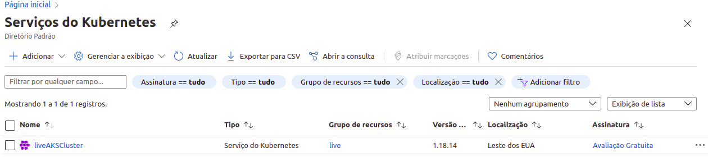

# AKS

## Live

* [SUPER AULÃO AO VIVO - DESCOMPLICANDO O KUBERNETES - EDIÇÃO CLOUD | AKS](https://www.youtube.com/watch?v=zT6qDKf87Do)

## Azure cli

* [Install the Azure CLI on Linux](https://docs.microsoft.com/pt-br/cli/azure/install-azure-cli-linux?pivots=apt)

```sh
curl -sL https://aka.ms/InstallAzureCLIDeb | sudo bash
az login
```

## K8s init

* [kubernetes-walkthrough](https://docs.microsoft.com/en-us/azure/aks/kubernetes-walkthrough)

### resourceGroups

```sh
az group create --name live --location eastus
```

```json
{
  "id": "/subscriptions/<>/resourceGroups/live",
  "location": "eastus",
  "managedBy": null,
  "name": "live",
  "properties": {
    "provisioningState": "Succeeded"
  },
  "tags": null,
  "type": "Microsoft.Resources/resourceGroups"
}
```

### AKS create

```sh
az aks create \
    --resource-group live \
    --name liveAKSCluster \
    --node-count 1 \
    --enable-addons monitoring \
    --generate-ssh-keys
```
 
 
#### Error quota

BadRequestError: Operation failed with status: 'Bad Request'. Details: Provisioning of resource(s) for container service liveAKSCluster in resource group live failed. Message: Operation could not be completed as it results in exceeding approved Total Regional Cores quota. Additional details - Deployment Model: Resource Manager, Location: eastus, Current Limit: 4, Current Usage: 0, Additional Required: 6, (Minimum) New Limit Required: 6. Submit a request for Quota increase at link by specifying parameters listed in the ‘Details’ section for deployment to succeed. Please read more about quota limits at https://docs.microsoft.com/en-us/azure/azure-supportability/regional-quota-requests.. Details: 

Mudei de node-count de 3 para 1

### aks cli

```sh
# dowload kubectl
sudo az aks install-cli
az aks get-credentials --resource-group live --name liveAKSCluster
```

```sh
kubectl get nodes
NAME                                STATUS   ROLES   AGE     VERSION
aks-nodepool1-21890317-vmss000000   Ready    agent   3m52s   v1.18.14

kubectl get pods --all-namespaces

kubectl get pods --all-namespaces
NAMESPACE     NAME                                  READY   STATUS    RESTARTS   AGE
kube-system   coredns-748cdb7bf4-w4kld              1/1     Running   0          4m50s
kube-system   coredns-748cdb7bf4-xdc7l              1/1     Running   0          3m54s
kube-system   coredns-autoscaler-868b684fd4-tfgpq   1/1     Running   0          4m45s
kube-system   kube-proxy-vf6lf                      1/1     Running   0          4m24s
kube-system   metrics-server-58fdc875d5-n27wc       1/1     Running   0          4m50s
kube-system   omsagent-r4rzq                        1/1     Running   1          4m24s
kube-system   omsagent-rs-6555dcd5bc-fn9ck          1/1     Running   0          4m50s
kube-system   tunnelfront-775f6887c5-rtg4z          1/1     Running   0          4m47s
```

### https ingress

* [ingress-tls](https://docs.microsoft.com/en-us/azure/aks/ingress-tls)

```sh
# Create a namespace for your ingress resources
kubectl create namespace ingress-basic

curl -fsSL -o get_helm.sh https://raw.githubusercontent.com/helm/helm/master/scripts/get-helm-3
chmod 700 get_helm.sh
./get_helm.sh


# Add the ingress-nginx repository
helm repo add ingress-nginx https://kubernetes.github.io/ingress-nginx

# Use Helm to deploy an NGINX ingress controller
helm install nginx-ingress ingress-nginx/ingress-nginx \
    --namespace ingress-basic \
    --set controller.replicaCount=2 \
    --set controller.nodeSelector."beta\.kubernetes\.io/os"=linux \
    --set defaultBackend.nodeSelector."beta\.kubernetes\.io/os"=linux \
    --set controller.admissionWebhooks.patch.nodeSelector."beta\.kubernetes\.io/os"=linux
```

```yml
NAME: nginx-ingress
LAST DEPLOYED: Sat Jan 30 19:03:07 2021
NAMESPACE: ingress-basic
STATUS: deployed
REVISION: 1
TEST SUITE: None
NOTES:
The ingress-nginx controller has been installed.
It may take a few minutes for the LoadBalancer IP to be available.
You can watch the status by running 'kubectl --namespace ingress-basic get services -o wide -w nginx-ingress-ingress-nginx-controller'

An example Ingress that makes use of the controller:

  apiVersion: networking.k8s.io/v1beta1
  kind: Ingress
  metadata:
    annotations:
      kubernetes.io/ingress.class: nginx
    name: example
    namespace: foo
  spec:
    rules:
      - host: www.example.com
        http:
          paths:
            - backend:
                serviceName: exampleService
                servicePort: 80
              path: /
    # This section is only required if TLS is to be enabled for the Ingress
    tls:
        - hosts:
            - www.example.com
          secretName: example-tls

If TLS is enabled for the Ingress, a Secret containing the certificate and key must also be provided:

  apiVersion: v1
  kind: Secret
  metadata:
    name: example-tls
    namespace: foo
  data:
    tls.crt: <base64 encoded cert>
    tls.key: <base64 encoded key>
  type: kubernetes.io/tls
```

```sh
kubectl get pods -n ingress-basic
NAME                                                     READY   STATUS    RESTARTS   AGE
nginx-ingress-ingress-nginx-controller-674d5d48b-jskkh   1/1     Running   0          2m52s
nginx-ingress-ingress-nginx-controller-674d5d48b-nmsp9   1/1     Running   0          2m52s

kubectl get svc -n ingress-basickubectl get svc -n ingress-basic
NAME                                               TYPE           CLUSTER-IP     EXTERNAL-IP     PORT(S)                      AGE
nginx-ingress-ingress-nginx-controller             LoadBalancer   10.0.170.162   20.62.149.127   80:31880/TCP,443:30239/TCP   4m11s
nginx-ingress-ingress-nginx-controller-admission   ClusterIP      10.0.209.68    <none>          443/TCP                      4m11s

kubectl --namespace ingress-basic get services -o wide -w 
```

### Add an A record to your DNS zone

```sh
# Public IP address of your ingress controller
export IP="20.62.149.127"

# Name to associate with public IP address
export DNSNAME="aks-live"

# Get the resource-id of the public ip
export PUBLICIPID=$(az network public-ip list --query "[?ipAddress!=null]|[?contains(ipAddress, '$IP')].[id]" --output tsv)

# Update public ip address with DNS name
az network public-ip update --ids $PUBLICIPID --dns-name $DNSNAME

# Display the FQDN
az network public-ip show --ids $PUBLICIPID --query "[dnsSettings.fqdn]" --output tsv
# aks-live.eastus.cloudapp.azure.com
```

```json
{
  "ddosSettings": null,
  "dnsSettings": {
    "domainNameLabel": "aks-live",
    "fqdn": "aks-live.eastus.cloudapp.azure.com",
    "reverseFqdn": null
  },
  "etag": "W/\"244e96d8-d4c0-49e6-9883-afb21efd3378\"",
  "extendedLocation": null,
  "id": "<>",
  "idleTimeoutInMinutes": 4,
  "ipAddress": "20.62.149.127",
  "ipConfiguration": {
    "etag": null,
    "id": "<>",
    "name": null,
    "privateIpAddress": null,
    "privateIpAllocationMethod": null,
    "provisioningState": null,
    "publicIpAddress": null,
    "resourceGroup": "mc_live_liveakscluster_eastus",
    "subnet": null
  },
  "ipTags": [],
  "location": "eastus",
  "name": "kubernetes-a2d5cc6011e614889a2a45c818b8aacd",
  "provisioningState": "Succeeded",
  "publicIpAddressVersion": "IPv4",
  "publicIpAllocationMethod": "Static",
  "publicIpPrefix": null,
  "resourceGroup": "mc_live_liveakscluster_eastus",
  "resourceGuid": "<>",
  "sku": {
    "name": "Standard",
    "tier": "Regional"
  },
  "tags": {
    "kubernetes-cluster-name": "kubernetes",
    "service": "ingress-basic/nginx-ingress-ingress-nginx-controller"
  },
  "type": "Microsoft.Network/publicIPAddresses",
  "zones": null
}
```

### Install cert-manager

```sh
# Label the ingress-basic namespace to disable resource validation
kubectl label namespace ingress-basic cert-manager.io/disable-validation=true

# Add the Jetstack Helm repository
helm repo add jetstack https://charts.jetstack.io

# Update your local Helm chart repository cache
helm repo update

# Install the cert-manager Helm chart
helm install cert-manager jetstack/cert-manager \
  --namespace ingress-basic \
  --version v0.16.1 \
  --set installCRDs=true \
  --set nodeSelector."kubernetes\.io/os"=linux \
  --set webhook.nodeSelector."kubernetes\.io/os"=linux \
  --set cainjector.nodeSelector."kubernetes\.io/os"=linux
```

```txt
NAME: cert-manager
LAST DEPLOYED: Sat Jan 30 19:22:48 2021
NAMESPACE: ingress-basic
STATUS: deployed
REVISION: 1
TEST SUITE: None
NOTES:
cert-manager has been deployed successfully!

In order to begin issuing certificates, you will need to set up a ClusterIssuer
or Issuer resource (for example, by creating a 'letsencrypt-staging' issuer).

More information on the different types of issuers and how to configure them
can be found in our documentation:

https://cert-manager.io/docs/configuration/

For information on how to configure cert-manager to automatically provision
Certificates for Ingress resources, take a look at the `ingress-shim`
documentation:

https://cert-manager.io/docs/usage/ingress/
```

### Create a CA cluster issuer

```sh
kubectl apply -f cluster-issuer.yaml

kubectl get clusterissuer.cert-manager.io/letsencrypt
NAME          READY   AGE
letsencrypt   True    49s
```

### Run demo applications

```sh
kubectl apply -f aks-helloworld-one.yaml --namespace ingress-basic
kubectl apply -f aks-helloworld-two.yaml --namespace ingress-basic

kubectl get pods  --namespace ingress-basic
NAME                                                     READY   STATUS    RESTARTS   AGE
aks-helloworld-one-57769987dd-x9wg4                      1/1     Running   0          55s
aks-helloworld-two-5dd46f675c-lp2st                      1/1     Running   0          50s
cert-manager-766b9d486-td42k                             1/1     Running   0          10m
cert-manager-cainjector-58f69f5575-2m5w9                 1/1     Running   0          10m
cert-manager-webhook-6c9cb54dc6-sfsgz                    1/1     Running   0          10m
nginx-ingress-ingress-nginx-controller-674d5d48b-jskkh   1/1     Running   0          30m
nginx-ingress-ingress-nginx-controller-674d5d48b-nmsp9   1/1     Running   0          30m

kubectl get svc --namespace ingress-basic
NAME                                               TYPE           CLUSTER-IP     EXTERNAL-IP     PORT(S)                      AGE
aks-helloworld-one                                 ClusterIP      10.0.39.221    <none>          80/TCP                       80s
aks-helloworld-two                                 ClusterIP      10.0.211.252   <none>          80/TCP                       75s
cert-manager                                       ClusterIP      10.0.36.133    <none>          9402/TCP                     11m
cert-manager-webhook                               ClusterIP      10.0.68.123    <none>          443/TCP                      11m
nginx-ingress-ingress-nginx-controller             LoadBalancer   10.0.170.162   20.62.149.127   80:31880/TCP,443:30239/TCP   30m
nginx-ingress-ingress-nginx-controller-admission   ClusterIP      10.0.209.68    <none>          443/TCP                      30m
```

### Create an ingress route

```sh
kubectl apply -f hello-world-ingress.yaml --namespace ingress-basic

NAME                                                     READY   STATUS    RESTARTS   AGE
aks-helloworld-one-57769987dd-x9wg4                      1/1     Running   0          6m46s
aks-helloworld-two-5dd46f675c-lp2st                      1/1     Running   0          6m41s
cert-manager-766b9d486-td42k                             1/1     Running   0          16m
cert-manager-cainjector-58f69f5575-2m5w9                 1/1     Running   0          16m
cert-manager-webhook-6c9cb54dc6-sfsgz                    1/1     Running   0          16m
cm-acme-http-solver-k4nz7                                1/1     Running   0          20s
nginx-ingress-ingress-nginx-controller-674d5d48b-jskkh   1/1     Running   0          36m
nginx-ingress-ingress-nginx-controller-674d5d48b-nmsp9   1/1     Running   0          36m

```

### Verify a certificate object has been created

```sh
kubectl get certificate --namespace ingress-basic

NAME         READY   SECRET       AGE
tls-secret   True    tls-secret   2m20s
```

### Clean up resources

```sh
kubectl delete namespace ingress-basic
kubectl delete -f cluster-issuer.yaml --namespace ingress-basic

helm list --namespace ingress-basic
helm uninstall cert-manager nginx --namespace ingress-basic

kubectl delete -f aks-helloworld-one.yaml --namespace ingress-basic
kubectl delete -f aks-helloworld-two.yaml --namespace ingress-basic

kubectl delete namespace ingress-basic

az aks delete \
    --resource-group live \
    --name liveAKSCluster

az group delete --name live
```